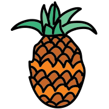
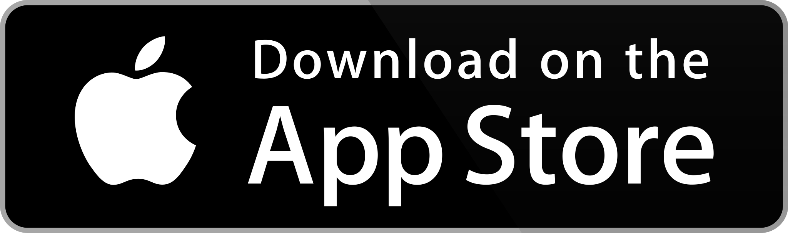
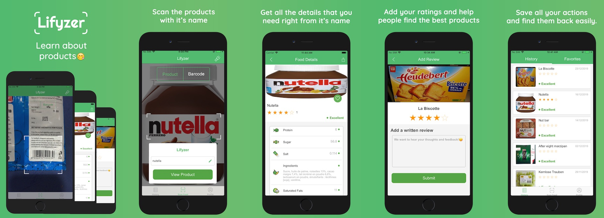

# iOS Swift Food Scanner App 🍍

The native iPhone nutrition food app that detects the healthy and unhealthy food for you 🪄

_🍎 The native [iOS Food Scanner App](https://apps.apple.com/app/longer-life-lifyzer-food-scan/id1466196809) 🥕_

### About Lifyzer, Healthy Food Scanner 🍳

**Lifyzer Healthy Food Solution™** instantly gives the healthy score and useful details of any food or items you want to eat or purchase.

Made with ❤️ by [Pierre-Henry Soria](https://pierrehenry.be). _A healthy &amp; passionate software engineer. Love eating healthy! Eager to learn 🍏 Eager to share 🍅_

## Installation 🛠

Run `pod install` to install the dependencies (make sure your have [Cocoapods](https://guides.cocoapods.org/using/getting-started.html#installation) installed).

## Yummy Screenshots 😍

The Open source nutrition Scanning mobile iOS app 🍍

