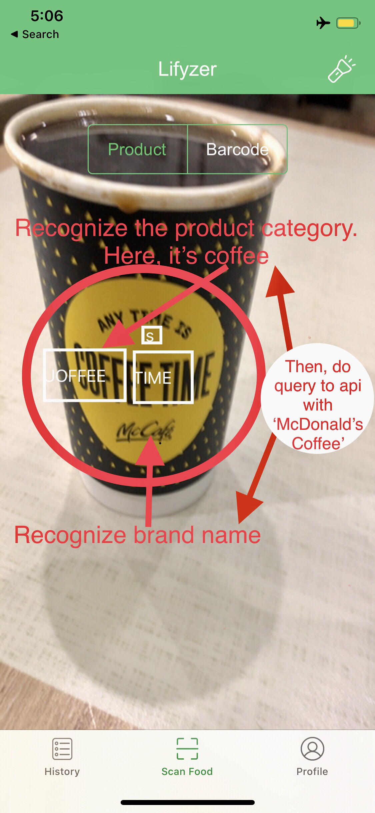

## 👉 Yummy upcoming features to be done 😋

* Improve OCR feature (‘PRODUCT’ tab on camera view of the app). Ideally, the app should directly recognize the brand’s name of any items. It should be smart enough to distinguish the name, the category of its subclass, and so on, and build a query to send to the API, which then will be found in the database.. See attached an example of an item. Here, for the example might look a bit difficult compare to other traditional product, but it should read that it is a “McDonald’s Coffee Cup”.
At the moment, the user sees several product’s keywords which are from the product, and has to select the correct one (which is the ‘product name’), then click on search button to see the item. You will see, it’s not a good user experience. It should instantly show the product according to the product name and what’s the API has in its database. 

* Cache queries when possible in the PHP API, code refactoring and improve/secure the API, and facilitate any further new features, endpoints. 
I believe this one is really important. It will help your team to understand how the backend works, behind the scene, and help them to be more efficient to work on new features, later on.

* [Low Priority] Specific to the [iOS GitHub repo](https://github.com/Lifyzer/Food-Scanner-Swift-App): The iOS app uses dependencies with CocoaPods, and all pods are committed on GitHub, except a few ones which exceed 100mb (GitHub doesn’t allow binary file bigger than 100mb).
I’m not sure if it’s still a good idea to commit all of them, or migrate package dependencies to something newer, like SPM? 

-----

Wanna help? 😼 **Just drop a new [Pull Request](https://github.com/Lifyzer/Food-Scanner-Swift-App/pulls)**, and I will be glad to review your changes 😻
